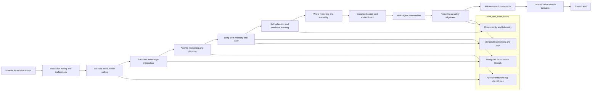

# agi-workflow

```mermaid
graph LR  
  A[Pretrain foundation model] --> B[Instruction tuning and preferences]  
  B --> C[Tool use and function calling]  
  C --> D[RAG and knowledge integration]  
  D --> E[Agentic reasoning and planning]  
  E --> F[Long-term memory and state]  
  F --> G[Self-reflection and continual learning]  
  G --> H[World modeling and causality]  
  H --> I[Grounded action and embodiment]  
  I --> J[Multi-agent cooperation]  
  J --> K[Robustness safety alignment]  
  K --> L[Autonomy with constraints]  
  L --> M[Generalization across domains]  
  M --> N[Toward AGI]  
  
  subgraph Infra_and_Data_Plane  
    I1[MongoDB Atlas Vector Search]  
    I2[MongoDB collections and logs]  
    I3[Agent framework e.g. LlamaIndex]  
    I4[Observability and telemetry]  
  end  
  
  C --> I3  
  D --> I1  
  E --> I3  
  F --> I1  
  F --> I2  
  G --> I4  
  K --> I2  
  K --> I4  

```
